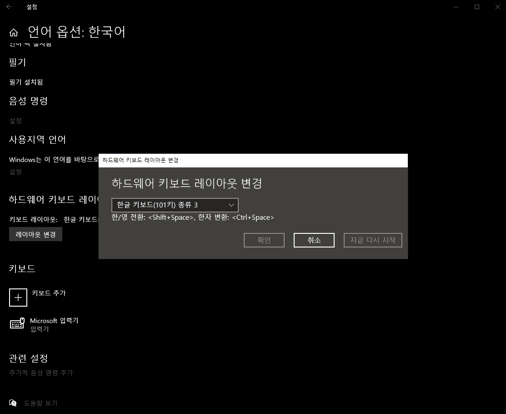
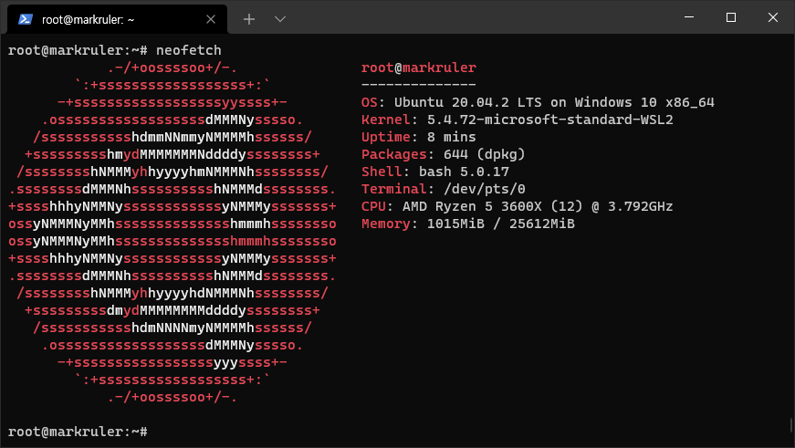

# Windows Desktop

- [Windows Desktop](#windows-desktop)
  - [한영전환키 변경](#한영전환키-변경)
  - [Hyper-V 활성화](#hyper-v-활성화)
  - [WSL2 (Windows Subsystem for Linux 2) 활성화](#wsl2-windows-subsystem-for-linux-2-활성화)
    - [Docker for Windows와 같이 사용할 경우 주의할 점](#docker-for-windows와-같이-사용할-경우-주의할-점)
    - [Locale 설정](#locale-설정)
  - [Package Manager](#package-manager)
    - [scoop](#scoop)
    - [Chocolatey](#chocolatey)
  - [neofetch](#neofetch)
  - [sdkman](#sdkman)
  - [nvm](#nvm)
  - [Windows Terminal](#windows-terminal)
    - [ConEmu](#conemu)
    - [posh-git](#posh-git)
    - [oh-my-posh](#oh-my-posh)
      - [automatically applied every time it starts](#automatically-applied-every-time-it-starts)
      - [to set a font (Nerd Fonts)](#to-set-a-font-nerd-fonts)
      - [in Windows terminal app](#in-windows-terminal-app)
      - [in VS Code](#in-vs-code)
      - [Git](#git)
  - [Windows Defender](#windows-defender)

## 한영전환키 변경

> 언어 설정 > 기본 설정 언어 > 한국어 > 옵션 > 하드웨어 키보드 레이아웃

| layout                   | 한/영 전환        | 한자 전환        | 비고                                                     |
| ------------------------ | ----------------- | ---------------- | -------------------------------------------------------- |
| 한글 키보드(103/106키)   | `한/영`           | `한자`           | 한국에서만 쓰임                                          |
| 한글 키보드(101키) 종류1 | 오른쪽 `Alt`      | 오른쪽 `Ctrl`    | ✅                                                       |
| 한글 키보드(101키) 종류2 | 오른쪽 `Ctrl`     | 오른쪽 `Alt`     | 익숙하지 않음                                            |
| 한글 키보드(101키) 종류3 | `Shift` + `Space` | `Ctrl` + `Space` | IDE에서 자동 완성 기능이 주로 `Ctrl` + `Space` 라서 충돌 |



## Hyper-V 활성화

```powershell
Enable-WindowsOptionalFeature -Online -FeatureName Microsoft-Hyper-V -All
# reboot
```

## WSL2 (Windows Subsystem for Linux 2) 활성화

- [Microsoft manual](https://docs.microsoft.com/en-us/windows/wsl/install-win10)
- [44bits 참고](https://www.44bits.io/ko/post/wsl2-install-and-basic-usage)

Windows PowerShell을 관리자 권한으로 열어서 (`Shift` + `Ctrl` + `Mouse Left`) 아래 명령어를 차례대로 실행시킵니다.

```powershell
dism.exe /online /enable-feature /featurename:Microsoft-Windows-Subsystem-Linux /all /norestart
dism.exe /online /enable-feature /featurename:VirtualMachinePlatform /all /norestart
```

```powershell
Restart-Computer
```

- [wsl](https://aka.ms/wslstore)

```powershell
# wsl --list --verbose
wsl -l -v
#   NAME      STATE           VERSION
# * Ubuntu    Running         1
```

- [wsl2](https://docs.microsoft.com/ko-kr/windows/wsl/install-win10#step-4---download-the-linux-kernel-update-package)
  - `x64 머신용 최신 WSL2 Linux 커널 업데이트 패키지` 설치

```powershell
# 두 버전의 WSL에 의해 지원되도록 배포를 설정하려면 다음을 실행합니다.
# wsl --set-version <distribution name> <versionNumber>
wsl --set-version Ubuntu 2

# WSL 2를 기본 아키텍처로 설정하려는 경우 이 명령을 사용하여 수행할 수 있습니다.
wsl --set-default-version 2
```

WSL을 사용하고 싶다면 원하는 위치에서 `wsl` 명령어를 실행시킵니다.

```powershell
wsl
```

WSL2의 네트워크는 Hyper-V 가상화 기반으로 동작하고 있어서 부득이하게 이 IP는 재부팅 시 변경되어 버리니 주의가 필요합니다.

```bash
ip -br -c -4 a show eth0
# eth0             UP             172.25.17.72/20
```

```bash
sudo -i
apt-get update
apt-get install -y neofetch
```



### Docker for Windows와 같이 사용할 경우 주의할 점

Docker for Windows를 설치한 후 `Settings > General`에서 `Use the WSL 2 based engine`이
활성화(default) 되어있다면 네트워크 어댑터가 충돌해서(?)  WSL에 접속하면 인터넷 연결이 되지 않는다.
Docker for Windows의 `Settings > Resources > WSL Integration`에서
`Enable integration with my default WSL distro`을 활성화해준다.

### Locale 설정

```bash
locale
# LANG=C.UTF-8

sudo apt-get install -y language-pack-ko

sudo vi /etc/default/locale
# LANG=ko_KR.UTF-8
# LC_MESSAGES=POSIX
```

다시 `wsl` 재접속

```bash
locale
# LANG=ko_KR.UTF-8
```

## Package Manager

### scoop

- [lukesampson/scoop](https://github.com/lukesampson/scoop)

```powershell
Set-ExecutionPolicy RemoteSigned -scope CurrentUser
Invoke-Expression (New-Object System.Net.WebClient).DownloadString('https://get.scoop.sh')
```

### Chocolatey

- [chocolatey/choco](https://github.com/chocolatey/choco)

```powershell
Set-ExecutionPolicy Bypass -Scope Process -Force; [System.Net.ServicePointManager]::SecurityProtocol = [System.Net.ServicePointManager]::SecurityProtocol -bor 3072; iex ((New-Object System.Net.WebClient).DownloadString('https://community.chocolatey.org/install.ps1'))
```

## neofetch

- [dylanaraps/neofetch](https://github.com/dylanaraps/neofetch)

```powershell
scoop install neofetch
scoop install git
neofetch
```


## sdkman

- [Download](https://sdkman.io/)

```bash
# sdkman이 의존하는 zip 설치
scoop search zip
scoop install zip

# sdkman 설치
curl -s "https://get.sdkman.io" | bash
source "/c/Users/imcxs/.sdkman/bin/sdkman-init.sh"
```

```bash
sdk version
> SDKMAN 5.11.2+698
```

```bash
sdk list
# [gradle, maven, java, ...]

# sdk list [package]
sdk install maven 3.6.3
sdk install gradle 6.8.3
sdk install java 11.0.11.hs-adpt
```

## nvm

- [nvm-sh/nvm](https://github.com/nvm-sh/nvm)

Node.js 버전 매니저

```powershell
scoop install nvm
nvm version
# 1.1.7
```

```powershell
nvm list available
# |   CURRENT    |     LTS      |  OLD STABLE  | OLD UNSTABLE |
# |--------------|--------------|--------------|--------------|
# |    16.1.0    |   14.16.1    |   0.12.18    |   0.11.16    |
# |    16.0.0    |   14.16.0    |   0.12.17    |   0.11.15    |
# |   15.14.0    |   14.15.5    |   0.12.16    |   0.11.14    |
# |   15.13.0    |   14.15.4    |   0.12.15    |   0.11.13    |
# [...]

nvm install 14.16.1
nvm use 14.16.1
```

```powershell
node -v
# v14.16.1

npm -v
# 6.14.12

Get-Command node
# C:\Users\imcxs\scoop\apps\nvm\current\nodejs\nodejs\node.exe
```

## Windows Terminal

- [Download](https://www.microsoft.com/en-us/p/windows-terminal-preview/9n0dx20hk701)
- [How to make a pretty prompt in Windows Terminal with Powerline, Nerd Fonts, Cascadia Code, WSL, and oh-my-posh](https://www.hanselman.com/blog/HowToMakeAPrettyPromptInWindowsTerminalWithPowerlineNerdFontsCascadiaCodeWSLAndOhmyposh.aspx)


> - To split a pane vertically, `Alt` + `Shift` + `=`
> - To split a pane horizontally, `Alt` + `Shift` + `-`


- `profiles.json` 설정
- run as a Administrator: `Ctrl` + `Shift` + `Mouse Left`
  - [(by default)](http://nuts4.net/post/windows-terminal-run-as-admin): `C:\Windows\system32\cmd.exe /c start /b wt`

### ConEmu

- [Download](https://conemu.github.io/)

```PowerShell
choco install ConEmu
```

### posh-git

[dahlbyk/posh-git](https://github.com/dahlbyk/posh-git)

- a PowerShell module that integrates Git and PowerShell by providing Git status summary information that can be displayed in the PowerShell prompt, e.g.

```PowerShell
Install-Module posh-git -Scope CurrentUser
```

### oh-my-posh

- [JanDeDobbeleer/oh-my-posh](https://github.com/JanDeDobbeleer/oh-my-posh?WT.mc_id=-blog-scottha)

```ps
Install-Module oh-my-posh -Scope CurrentUser
```

#### automatically applied every time it starts

```ps
Install-Module -Name PSReadLine -AllowPrerelease -Scope CurrentUser -Force -SkipPublisherCheck

if (!(Test-Path -Path $PROFILE )) { New-Item -Type File -Path $PROFILE -Force }
notepad $PROFILE

# 위를 입력하면 Microsoft.PowerShell_profile.ps1 파일 생성되어 열린다.

# (vs code가 있다면 code $PROFILE)

# 경로는 $PROFILE 입력하면 나옴

# 해당 파일에 아래의 명령어들 입력-저장

Import-Module posh-git
Import-Module oh-my-posh
Set-Theme paradox
```

#### to set a font (Nerd Fonts)

- [Download](https://www.nerdfonts.com/)

```ps
$ThemeSettings
$ThemeSettings.GitSymbols.BranchSymbol = [char]::ConvertFromUtf32(0xE0A0)
```

#### in Windows terminal app

- [Install a compatible Font for the terminal.](https://www.nerdfonts.com/)

```ps
# Inside of the Windows Terminal, go to Settings and add the fontFace line to your profile.json under the Ubuntu and PowerShell section.
# 경로 모르면 그냥 Terminal 앱에서 settings
"fontFace": "Delugia Nerd Font"
```

#### in VS Code

```powershell
# setting.json
"terminal.integrated.fontFamily": "Delugia Nerd Font"
```

#### Git

```bash
git config --global core.editor=vim
```

```powershell
$GitPromptSettings
$DefaultUser = 'yourUsernameHere'
```

## Windows Defender

Windows 11로 업데이트 후 Windows Defender를 열 수 없는 경우 아래 커맨드를 사용한다.

```powershell
Get-AppxPackage Microsoft.SecHealthUI -AllUsers | Reset-AppxPackage
```
